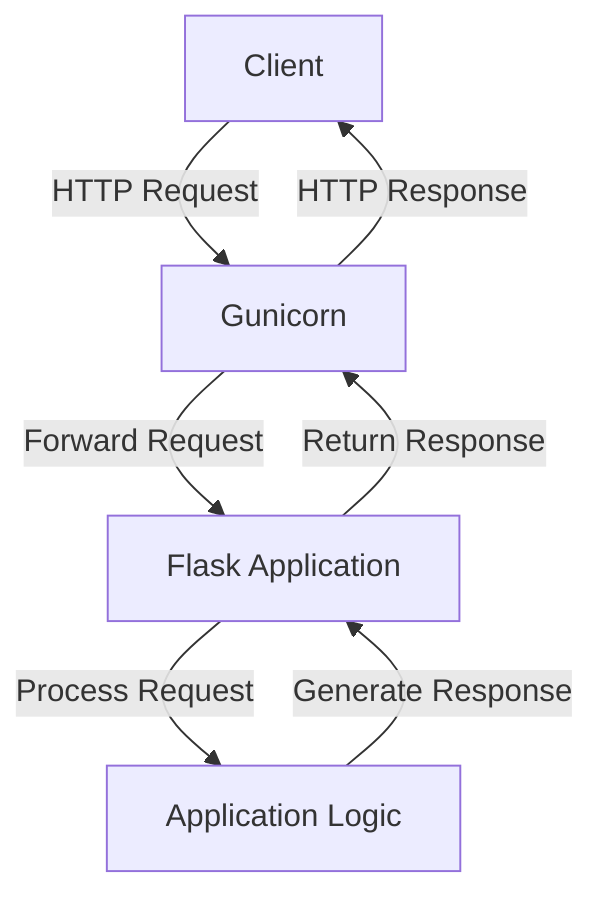

# Gunicorn: Simple Proof of Concept

| Author | Created on | Version | Last updated by | Last edited on |
|--------|------------|---------|----------------|----------------|
| Amit Nagar | 12-09-2024 | 1.0 | Amit Nagar | 17-09-2024 |


## Table of Contents
1. [Purpose](#purpose)
2. [Pre-requisites](#pre-requisites)
   - [System Requirements](#system-requirements)
   - [Dependencies](#dependencies)
   - [Important Ports](#important-ports)
3. [Architecture](#architecture)
4. [Step-by-step installation](#step-by-step-installation)
5. [Troubleshooting](#troubleshooting)
6. [FAQs](#faqs)
7. [Contact Information](#contact-information)
8. [References](#references)

## Purpose
This Proof of Concept (POC) demonstrates the basic setup and usage of Gunicorn, a WSGI HTTP Server for Python applications. It aims to show how to deploy a simple Flask application using Gunicorn, highlighting its key features and benefits.

## Pre-requisites

### System Requirements

| Hardware Specifications | Minimum Recommendation |
|-------------------------|------------------------|
| Processor               | single-core              |
| RAM                     | 1GB                    |
| Disk                    | 10GB                   |
| OS                      | Ubuntu 22.04           |

### Dependencies

| Name     | Version | Description                              |
|----------|---------|------------------------------------------|
| Python   | 3.8+    | Programming language for the application |
| pip      | 20.0+   | Package installer for Python             |
| Gunicorn | 23.0.0  | WSGI HTTP Server                         |
| Flask    |^2.3.2   | Web framework for Python                 |

### Important Ports

| Inbound Traffic | Description     |
|-----------------|-----------------|
| 8000            | Used by Gunicorn|

## Architecture



This simple architecture illustrates:
1. Client sends an HTTP request to Gunicorn.
2. Gunicorn forwards the request to the Flask application.
3. The Flask application processes the request and generates a response.
4. Gunicorn sends the response back to the client.

## Step-by-step installation

### Step 1: System Preparation

```bash
# Update system packages
sudo apt update -y

# Install Python and pip
sudo apt install -y  python3-pip
```

### Step 2: Create a Virtual Environment

```bash
# Create and activate a virtual environment
python3 -m venv venv
source venv/bin/activate
```


### step 3: Activate virtual environment
```
source venv/bin/activate
```


### Step 3: Install Dependencies

```bash
# Upgrade pip
pip install --upgrade pip

# Install Gunicorn and Flask
pip install gunicorn flask
```


### Step 4: Create a Sample Flask Application

Create a file named `app.py`:

```python
from flask import Flask

app = Flask(__name__)

@app.route('/')
def hello():
    return "Hello, Gunicorn!"

@app.route('/health')
def health():
    return "OK", 200

if __name__ == '__main__':
    app.run()
```


### Step 5: Run the Application with Gunicorn

```bash
gunicorn --workers 3 --bind 0.0.0.0:8000 app:app
```


Now go to webserver and search <ip_of_server>:8000


## Troubleshooting

1. **Gunicorn fails to start**: 
   - Check if the port is already in use: `sudo lsof -i :8000`
   - Verify Python dependencies are installed correctly

2. **High response times**:
   - Monitor CPU and memory usage
   - Consider increasing the number of worker processes

3. **Worker timeout issues**:
   - Adjust the timeout setting when starting Gunicorn
   - Optimize the application code for faster responses

## FAQs

1. **How many Gunicorn workers should I use?**
   A common rule of thumb is `(2 x $num_cores) + 1`, but this can be adjusted based on your specific workload and available resources.

2. **Is Gunicorn suitable for production use?**
   Yes, Gunicorn is widely used in production environments. However, for production, you might want to consider additional components like a reverse proxy for added features and security.

## Contact Information

| Name        | Email Address                          |
|-------------|----------------------------------------|
| Amit Nagar  | amit.nagar.snaatak@mygurukulam.co      |

## References

|Descriptions                                      | Links                                | 
|--------------------------------------------------|--------------------------------------|
|       Official Gunicorn documentation            |    https://docs.gunicorn.org/        |
|           Documentation of Gunicorn              |    https://github.com/mygurukulam-p10/Documention/tree/main/VCS%20Design%20%2B%20POC/Gunicorn/Introduction/                 |
|   Python virtual environments guide              |   https://docs.python.org/3/library/venv.html   |

